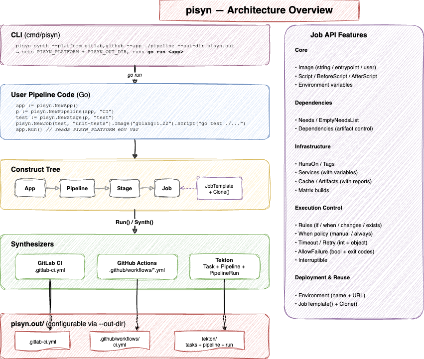
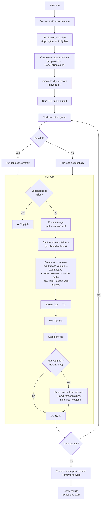

# ⚗️ pisyn — the pipeline synthesizer

Define CI/CD pipelines in Go, synthesize to GitLab CI, GitHub Actions, or Tekton.

Inspired by AWS CDK — write a construct tree, call `Run()`, get platform-specific YAML.

## Why pisyn?

CI/CD pipelines are defined in platform-specific YAML — GitLab CI, GitHub Actions, Tekton all have their own syntax. This creates real problems:

- **No type safety.** A typo in your `.gitlab-ci.yml` is only caught when the pipeline runs. No compiler, no autocomplete, no IDE support.
- **No real reuse.** GitLab's `extends` has surprising merge behavior. GitHub Actions' composite actions are limited. Sharing templates across repos means `include` directives with network dependencies.
- **Vendor lock-in.** Moving from GitLab to GitHub means rewriting every pipeline from scratch. There's no shared abstraction.
- **YAML doesn't scale.** A 50-job pipeline in YAML is thousands of lines of repetitive, hard-to-review config. Conditionals, loops, and composition require workarounds.

### What about Dagger, CUE, Jsonnet?

These tools exist but solve different problems:

| Tool | What it does | The gap |
|---|---|---|
| **Dagger** | Runs pipelines in its own Buildkit-based engine | Requires a runtime. Doesn't generate static YAML for existing CI systems. You can't just drop a file into GitLab and have it work. |
| **CUE** | Configuration language with types | Not a real programming language. No functions, no IDE refactoring, no package ecosystem. Still config, just fancier config. |
| **Jsonnet/Dhall** | Templating over YAML | Same category as CUE — you're still writing config, not code. Limited abstraction power. |
| **GitHub Actions reusable workflows** | Reuse within GitHub | GitHub-only. Can't target GitLab or Tekton. |
| **GitLab CI includes** | Reuse within GitLab | GitLab-only. Global namespace, no scoping, merge-order surprises. |

pisyn fills the gap: **write pipelines in a real programming language (Go), with full type safety and IDE support, and compile to static YAML that existing CI systems consume natively.** No runtime dependency, no new execution engine — just better authoring.

### The CDK model

AWS CDK proved that "define infrastructure in code, synthesize to config" works at scale. pisyn applies the same pattern to CI/CD:



- **App** → **Pipeline** → **Stage** → **Job** (like CDK's App → Stack → Construct)
- Every construct takes its parent as the first argument, forming a tree
- `Synth()` walks the tree and writes platform-specific files
- Templates are Go variables — share them as Go modules with proper versioning

## Quick Start


```go
package main

import (
    "log"

    "github.com/pipecrew/pisyn/pkg/pisyn"
    _ "github.com/pipecrew/pisyn/pkg/synth/gitlab"
)

func main() {
    app := pisyn.NewApp()
    p := pisyn.NewPipeline(app, "CI")

    test := pisyn.NewStage(p, "test")
    pisyn.NewJob(test, "unit-tests").
        Image("golang:1.26").
        Script("go test ./...")

    if err := app.Run(); err != nil {
        log.Fatal(err)
    }
}
```

Run directly or via the CLI:

```sh
go run main.go                          # synthesize all registered platforms
pisyn synth --platform gitlab --app .   # synthesize only GitLab via CLI
pisyn build --app .                     # build pipeline.json only
pisyn run --app .                       # run locally in Docker (auto-builds)
```

## Concepts

**App** → **Pipeline** → **Stage** → **Job**

Every construct takes its parent as the first argument, forming a tree — just like CDK.

```go
app := pisyn.NewApp()                    // root
p := pisyn.NewPipeline(app, "CI")        // pipeline in app
test := pisyn.NewStage(p, "test")        // stage in pipeline
pisyn.NewJob(test, "unit-tests")         // job in stage
```

## ⚗️ Synthesizers

Import synthesizer packages to register them. Blank imports (`_`) auto-register via `init()`:

```go
import (
    _ "github.com/pipecrew/pisyn/pkg/synth/gitlab"   // registers "gitlab"
    _ "github.com/pipecrew/pisyn/pkg/synth/github"   // registers "github"
    _ "github.com/pipecrew/pisyn/pkg/synth/tekton"   // registers "tekton"
)

// app.Run() synthesizes all registered platforms
app.Run()  // → pisyn.out/.gitlab-ci.yml, .github/workflows/<name>.yml, tekton/...
```

For programmatic control (e.g. in tests), call `Synth()` directly:

```go
import "github.com/pipecrew/pisyn/pkg/synth/gitlab"

app.Synth(gitlab.NewSynthesizer())  // → pisyn.out/.gitlab-ci.yml
```

## CLI

Install:

```sh
go install github.com/pipecrew/pisyn/cmd/pisyn@latest
```

Usage:

```sh
pisyn synth                                    # all registered platforms, app in current dir
pisyn synth --platform gitlab                  # GitLab only
pisyn synth --platform gitlab,github           # multiple platforms
pisyn synth --app ./pipeline                   # specify app directory
pisyn synth --out-dir ./output                 # custom output directory
pisyn synth --validate                         # synthesize and validate output
```

The CLI runs your Go pipeline code to build a construct tree, then synthesizes platform-specific YAML. Your code calls `app.Run()`, which builds `pipeline.json` and synthesizes all registered platforms.

### Build

Build the pipeline intermediate representation (JSON) without synthesizing:

```sh
pisyn build                                    # build pipeline.json from app in current dir
pisyn build --app ./pipeline                   # specify app directory
pisyn build --out-dir ./output                 # custom output directory
```

Other commands (`graph`, `run`) consume `pipeline.json` directly — they don't need to re-run your Go code.

### Validation

Validate generated YAML against official CI platform schemas:

```sh
pisyn validate                                 # validate all platforms in pisyn.out/
pisyn validate --platform gitlab               # GitLab only
pisyn validate --platform gitlab,github        # multiple platforms
pisyn validate --out-dir ./output              # custom output directory
```

Schemas are bundled in the binary and sourced from:
- **GitLab CI**: [gitlab.com/.gitlab-ci.yml schema](https://gitlab.com/gitlab-org/gitlab/-/raw/master/app/assets/javascripts/editor/schema/ci.json)
- **GitHub Actions**: [SchemaStore github-workflow.json](https://json.schemastore.org/github-workflow.json)

### Diff

Show what would change vs. existing output before writing files:

```sh
pisyn diff                                     # diff all platforms
pisyn diff --platform gitlab                   # diff GitLab only
pisyn diff --app ./pipeline                    # specify app directory
```

Exit code 0 = no changes, 1 = changes detected. Useful in CI to verify generated YAML is up to date.

### Pipeline Graph

Visualize the job dependency graph as a Mermaid diagram:

```sh
pisyn graph                                    # Mermaid output to stdout
pisyn graph --app ./pipeline                   # specify app directory
pisyn graph --output graph.png                 # render PNG via mmdc (requires mermaid-cli)
pisyn graph --output graph.svg                 # render SVG via mmdc
```

### Local Execution

Run pipelines locally in Docker containers with a live TUI for fast feedback before pushing:


```sh
pisyn run                                      # run all jobs with TUI
pisyn run --job unit-tests                     # run a single job
pisyn run --stage test                         # run all jobs in a stage
pisyn run --parallel                           # run independent jobs concurrently
pisyn run --no-tui                             # plain text output (for CI or piping)
pisyn run --app ./pipeline                     # specify app directory
```

The TUI shows a split-panel view: job list with status indicators on the left, live log output on the right. Navigate with `↑/↓` to select jobs, `pgup/pgdn` to scroll logs, `q` to quit.

```
┌─ Jobs ──────────────┬─ Logs (unit-tests) ──────────────────┐
│ ✅ lint        1.2s │ $ go test ./...                       │
│ 🔄 unit-tests  3.4s │ ok  pkg/pisyn       0.42s            │
│ ⏳ build            │ PASS                                  │
├─────────────────────┴───────────────────────────────────────┤
│ 1 passed  0 failed  1 running  1 pending │ 4.6s            │
└─────────────────────────────────────────────────────────────┘
```

Each job runs in a Docker container with the project directory copied into an isolated workspace volume. Your local files are never modified. Services (e.g. Postgres) are started on a shared network and addressable by alias. Platform-neutral variables (`$PISYN_COMMIT_SHA`, etc.) are resolved from the local git repo. Job outputs (`Output()` / `OutputRef()`) and cache (`SetCache()`) work locally via Docker volumes.



**Podman support:** pisyn uses the Docker SDK, which works with Podman's Docker-compatible socket. Set `DOCKER_HOST=unix:///run/user/1000/podman/podman.sock` — no code changes needed.

## Job API

```go
pisyn.NewJob(stage, "build").
    Image("golang:1.26").
    Script("go build ./...", "go test ./...").
    BeforeScript("echo starting").
    AfterScript("echo done").
    Needs("lint").
    RunsOn("ubuntu-latest").
    Env("CGO_ENABLED", "0").
    AddService("postgres:16", "db").
    AddStep(pisyn.Step{Uses: "actions/setup-go@v5", With: map[string]string{"go-version": "1.26"}}).
    SetArtifacts(pisyn.Artifacts{Paths: []string{"bin/"}, ExpireIn: "7 days"}).
    SetCache(pisyn.Cache{Key: "go-mod", Paths: []string{"/go/pkg/mod"}}).
    SetMatrix(map[string][]string{"go": {"1.21", "1.26"}}).
    SetEnvironment("production", "https://app.example.com").
    If(pisyn.VarCommitBranch + ` == "main"`).
    SetWhen(pisyn.Manual).
    Timeout(30).
    Retry(2).
    AllowFailure()
```

### Steps (GitHub Actions `uses:`)

Interleave pre-built action steps with scripts. Steps are rendered as `uses:` in GitHub Actions; GitLab/Tekton synthesizers extract only the script blocks.

```go
pisyn.NewJob(stage, "deploy").
    AddStep(pisyn.Step{Uses: "actions/setup-node@v4", With: map[string]string{"node-version": "20"}}).
    Script("npm install", "npm run build").
    AddStep(pisyn.Step{Uses: "actions/deploy-pages@v4"})
```

### Script Methods

```go
// Append a script block
job.Script("echo hello")

// Prepend before existing scripts (useful after Clone)
job.PrependScript("echo first")

// Set the script (replaces existing)
job.SetScript("echo replaced")

// Before/after scripts (one per job, replace semantics)
job.BeforeScript("cd src")
job.AfterScript("echo cleanup")
```

### Platform-Neutral Variables

Use `pisyn.Var*` constants for cross-platform pipelines. Each synthesizer translates them to the platform's native variables.

```go
pisyn.NewJob(stage, "deploy").
    If(pisyn.VarCommitBranch + ` == "main"`).
    Script("echo deploying " + pisyn.VarProjectPath + " at " + pisyn.VarCommitSHA)
```

| pisyn | GitLab CI | GitHub Actions |
|---|---|---|
| `pisyn.VarCommitBranch` | `$CI_COMMIT_BRANCH` | `${{ github.ref_name }}` |
| `pisyn.VarCommitSHA` | `$CI_COMMIT_SHA` | `${{ github.sha }}` |
| `pisyn.VarProjectPath` | `$CI_PROJECT_PATH` | `${{ github.repository }}` |
| `pisyn.VarJobToken` | `$CI_JOB_TOKEN` | `${{ secrets.GITHUB_TOKEN }}` |
| `pisyn.VarMRID` | `$CI_MERGE_REQUEST_ID` | `${{ github.event.pull_request.number }}` |

See `pkg/pisyn/vars.go` for the full list (17 variables).

### Job Outputs

Pass data between jobs using `Output()` and `OutputRef()`. Each synthesizer generates the platform-specific mechanism.

```go
gen := pisyn.NewJob(genStage, "gen-version").
    Script(`echo "VERSION=1.2.3" > build.env`).
    Output("VERSION", "build.env")

pisyn.NewJob(deployStage, "deploy").
    Needs("gen-version").
    Script("echo deploying version " + gen.OutputRef("VERSION"))
```

| Platform | Producing job | Consuming job |
|---|---|---|
| **GitLab CI** | `artifacts: reports: dotenv: [build.env]` | `$VERSION` (auto-injected via `needs`) |
| **GitHub Actions** | `cat build.env >> $GITHUB_OUTPUT` + `outputs:` | `${{ needs.gen-version.outputs.version }}` |

### Advanced: Rules, Tags, Retry, Allow Failure

```go
// Rules with conditions, changes, and when
pisyn.NewJob(stage, "deploy").
    AddRule(pisyn.Rule{If: "$CI_COMMIT_BRANCH == 'main'", When: "manual"}).
    AddRule(pisyn.Rule{Changes: []string{"deploy/**"}, When: "always"}).
    AddRule(pisyn.Rule{When: "never"})

// Tags for runner selection
pisyn.NewJob(stage, "build").
    AddTag("non-prod-workload", "docker")

// Retry with failure conditions
pisyn.NewJob(stage, "test").
    SetRetry(pisyn.RetryConfig{
        Max:  2,
        When: []string{"runner_system_failure", "stuck_or_timeout_failure"},
    })

// Allow failure only on specific exit codes
pisyn.NewJob(stage, "lint").
    AllowFailureOnExitCodes(1, 2)

// Artifact reports (junit, codequality, etc.)
pisyn.NewJob(stage, "test").
    SetArtifacts(pisyn.Artifacts{
        Paths: []string{"coverage.xml"},
        Reports: map[string][]string{
            "junit":       {"report.xml"},
            "codequality": {"gl-code-quality.json"},
        },
    })
```

### Interruptible, Dependencies, Empty Needs, Service Variables

```go
// Mark a job as interruptible (can be cancelled by newer pipelines)
pisyn.NewJob(stage, "test").
    SetInterruptible(true)

// Empty needs — start immediately without waiting for prior stages
pisyn.NewJob(stage, "lint").
    EmptyNeedsList()

// Dependencies — control which jobs' artifacts to download (separate from needs)
pisyn.NewJob(stage, "deploy").
    Needs("build").
    Dependencies("build")

// Services with variables (e.g. Kubernetes resource requests)
pisyn.NewJob(stage, "test").
    AddServiceWithVars(
        "postgres:16", "db",
        map[string]string{
            "KUBERNETES_SERVICE_CPU_REQUEST":    "1m",
            "KUBERNETES_SERVICE_MEMORY_REQUEST": "1Mi",
        },
    )
```

### Image Configuration

```go
// Simple string image
pisyn.NewJob(stage, "test").Image("golang:1.26")

// Image with entrypoint override (e.g. for images with non-shell entrypoints)
pisyn.NewJob(stage, "lint").
    Image("ghcr.io/astral-sh/ruff:0.15.7-alpine").
    ImageEntrypoint("")

// Image with docker user override
pisyn.NewJob(stage, "deploy").
    Image("alpine:latest").
    ImageUser("deployer")
```

## Pipeline Configuration

```go
pisyn.NewPipeline(app, "CI/CD").
    SetEnv("GO_VERSION", "1.26").
    OnPush("main", "develop").
    OnPushTag("v*").
    OnPushProtected().
    OnPR("main").
    OnSchedule("0 2 * * *")
```

### Workflow Rules

For advanced pipeline-level control (e.g. GitLab `workflow:rules`), use `AddWorkflowRule`:

```go
pisyn.NewPipeline(app, "CI").
    AddWorkflowRule(pisyn.Rule{If: "$CI_MERGE_REQUEST_ID"}).
    AddWorkflowRule(pisyn.Rule{
        If:        `$CI_COMMIT_REF_PROTECTED == "true"`,
        Variables: map[string]string{"PIPELINE_TYPE": "default_branch"},
    }).
    AddWorkflowRule(pisyn.Rule{
        If:   `$CI_COMMIT_MESSAGE =~ /\[(skip ci|ci skip)]/`,
        When: "never",
    })
```

If no explicit workflow rules are set, they are auto-generated from `OnPush`/`OnPushTag`/`OnPR`/`OnSchedule` triggers.

### Includes (GitLab CI)

Compose pisyn-generated pipelines with existing shared templates using GitLab CI `include:` directives:

```go
pisyn.NewPipeline(app, "CI").
    IncludeLocal("/templates/base.yml").
    IncludeRemote("https://example.com/ci.yml").
    IncludeProject("shared/templates", "ci/lint.yml", "main").
    IncludeTemplate("Auto-DevOps.gitlab-ci.yml")
```

All four GitLab include types are supported: `local`, `remote`, `project` (with `file` and optional `ref`), and `template`. Includes are rendered at the top of the generated `.gitlab-ci.yml`.

## Reusable Templates

```go
// Define a template (no parent scope)
goJob := pisyn.JobTemplate("go-base").
    Image("golang:1.26").
    SetCache(pisyn.Cache{Key: "go-mod", Paths: []string{"/go/pkg/mod"}})

// Clone into stages with different names
goJob.Clone(testStage, "unit-tests").Script("go test ./...")
goJob.Clone(testStage, "lint").Script("golangci-lint run")
goJob.Clone(buildStage, "build").Script("go build -o app .")
```

### Why Clone() instead of GitLab's `extends`

GitLab CI's `extends` keyword lets jobs inherit from other jobs or hidden templates. While useful, it has several problems that `Clone()` avoids:

**1. Merge order is implicit and surprising**

GitLab merges keys using a recursive strategy where the child overrides the parent, but for arrays (like `script`) the child *replaces* the entire array — there's no append. This leads to subtle bugs:

```yaml
# GitLab: extends replaces the entire script array
.base:
  script:
    - echo "setup"
    - run-tests

test-unit:
  extends: .base
  script:
    - run-unit-tests  # "echo setup" is gone — the whole array was replaced
```

With `Clone()`, what you see is what you get. The cloned job starts as a full copy, and you explicitly call `.Script(...)` to append or set scripts. No hidden merge rules.

**2. Diamond inheritance is undefined**

When a job extends multiple templates that share keys, GitLab's merge behavior depends on the order of `extends` entries and can produce results that are hard to predict:

```yaml
# GitLab: which image wins? You have to know the merge algorithm.
.go:
  image: golang:1.26
  variables:
    CGO_ENABLED: "0"

.with-cache:
  image: golang:1.26  # duplicated because you can't be sure
  cache:
    key: go-mod
    paths: [/go/pkg/mod]

test:
  extends: [.go, .with-cache]  # merge order matters
```

With `Clone()`, there's no inheritance chain. You clone one template and call builder methods. Composition is explicit:

```go
goJob := pisyn.JobTemplate("go").Image("golang:1.26").Env("CGO_ENABLED", "0")
goJob.Clone(stage, "test").
    SetCache(pisyn.Cache{Key: "go-mod", Paths: []string{"/go/pkg/mod"}}).
    Script("go test ./...")
```

**3. Hidden templates pollute the namespace**

GitLab requires hidden templates to start with a dot (`.base-job`). These still appear in the YAML, can conflict with other templates, and there's no scoping — every template is global. With `Clone()`, templates are Go variables with normal scoping rules. They don't appear in the output at all.

**4. No type safety or IDE support**

With `extends`, you reference templates by string name. Typos are only caught at pipeline runtime. With `Clone()`, the template is a Go variable — your IDE autocompletes it, and the compiler catches mistakes.

**5. `extends` can't cross repositories easily**

Sharing templates across projects in GitLab requires `include` + `extends`, which adds network dependencies and version pinning complexity. With pisyn, templates are Go code — share them as a Go module with proper versioning:

```go
import "github.com/yourorg/ci-templates/golang"

golang.TestJob.Clone(stage, "unit-tests").Script("go test ./...")
```

## Feature Support Matrix

| Feature | pisyn API | GitLab CI | GitHub Actions | Tekton | Local Run |
|---|---|---|---|---|---|
| Stages | ✅ | ✅ | ✅ (via needs) | ✅ (runAfter) | ✅ |
| Jobs with scripts | ✅ | ✅ | ✅ | ✅ | ✅ |
| Image (string) | ✅ | ✅ | ✅ (container) | ✅ | ✅ |
| Image (object with entrypoint) | ✅ | ✅ | ✅ (container.options) | ❌ | ✅ |
| Image (docker.user) | ✅ | ✅ | ❌ | ❌ | ❌ |
| Before/after scripts | ✅ | ✅ | ✅ | ✅ | ✅ |
| Job dependencies (needs) | ✅ | ✅ | ✅ | ✅ (runAfter) | ✅ |
| Empty needs (`needs: []`) | ✅ | ✅ | ❌ | ❌ | ✅ |
| Environment variables | ✅ | ✅ | ✅ | ❌ | ✅ |
| Matrix builds | ✅ | ✅ | ✅ | ❌ | ❌ |
| Artifacts (paths, expiry) | ✅ | ✅ | ✅ | ❌ | ✅ |
| Artifact reports (junit, codequality) | ✅ | ✅ | ❌ | ❌ | ❌ |
| Cache | ✅ | ✅ | ✅ | ❌ | ✅ |
| Services | ✅ | ✅ | ✅ | ❌ | ✅ |
| Service-level variables | ✅ | ✅ | ❌ | ❌ | ✅ |
| Deployment environments | ✅ | ✅ | ✅ | ❌ | ❌ |
| Conditions (if) | ✅ | ✅ (rules) | ✅ | ❌ | ❌ |
| Rules (when: always, changes) | ✅ | ✅ | ❌ | ❌ | ❌ |
| Timeout | ✅ | ✅ | ✅ | ❌ | ✅ |
| Retry (integer) | ✅ | ✅ | ❌ | ❌ | ❌ |
| Retry (object with when) | ✅ | ✅ | ❌ | ❌ | ❌ |
| Allow failure (boolean) | ✅ | ✅ | ✅ (continue-on-error) | ❌ | ✅ |
| Allow failure (exit codes) | ✅ | ✅ | ❌ | ❌ | ❌ |
| When policy (manual, always) | ✅ | ✅ | ❌ | ❌ | ❌ |
| Runner selection (runs-on) | ✅ | ❌ | ✅ | ❌ | ❌ |
| Tags | ✅ | ✅ | ❌ | ❌ | ❌ |
| Interruptible | ✅ | ✅ | ❌ | ❌ | ❌ |
| Extends / inheritance | ❌ | ❌ | ❌ | ❌ | ❌ |
| Steps (`uses:` actions) | ✅ | ❌ | ✅ | ❌ | ❌ |
| Triggers (push, tags, PR, schedule) | ✅ | ✅ | ✅ | ❌ | ❌ |
| Reusable templates (Clone) | ✅ | ✅ | ✅ | ✅ | ✅ |
| Pipeline-level env | ✅ | ✅ | ✅ | ❌ | ✅ |
| Local execution (TUI) | ✅ | ❌ | ❌ | ❌ | ✅ |
| Parallel execution | ✅ | ❌ | ❌ | ❌ | ✅ |

✅ = Supported  ❌ = Not yet implemented

## Output

All output goes to `pisyn.out/` by default (configurable via `--out-dir` flag or `app.OutDir` in code).

## Examples

| Example | What it demonstrates |
|---|---|
| [`basic/`](examples/basic/) | First pipeline — core construct tree, multi-platform, platform-neutral variables |
| [`advanced/`](examples/advanced/) | GitLab deep dive — rules, retry, exit codes, entrypoint overrides, artifact reports |
| [`golang/`](examples/golang/) | Production Go pipeline — templates, Clone(), job outputs, version injection, cross-platform |
| [`includes/`](examples/includes/) | GitLab include directives — all four types (local, remote, project, template) |
| [`components/`](examples/components/) | Typed pipeline components — the pisyn equivalent of GitLab CI components |
| [`dac/`](examples/dac/) | Real-world enterprise pipeline — 14 linters, clone-of-clone, services with vars |

Each example has its own README with a detailed explanation, the Mermaid pipeline graph, and instructions to run it.

## Run Tests

```sh
go test ./...
```

## Releasing

Releases are automated via [release-please](https://github.com/googleapis/release-please) and [GoReleaser](https://goreleaser.com/).

**Flow:**
1. Push conventional commits to `main` (`feat:`, `fix:`, `chore:`, etc.)
2. release-please maintains an open "Release PR" with accumulated changelog and version bump
3. Merge the Release PR → release-please creates a git tag (`v0.1.0`)
4. The tag triggers GoReleaser → cross-compiles binaries, creates a GitHub Release with changelog and checksums

**Manual release** (if needed):

```sh
git tag v0.1.0
git push origin v0.1.0
```

### Installing a release

```sh
# Via go install (requires Go)
go install github.com/pipecrew/pisyn/cmd/pisyn@v0.1.0

# Or download a binary from the GitHub Releases page
```
