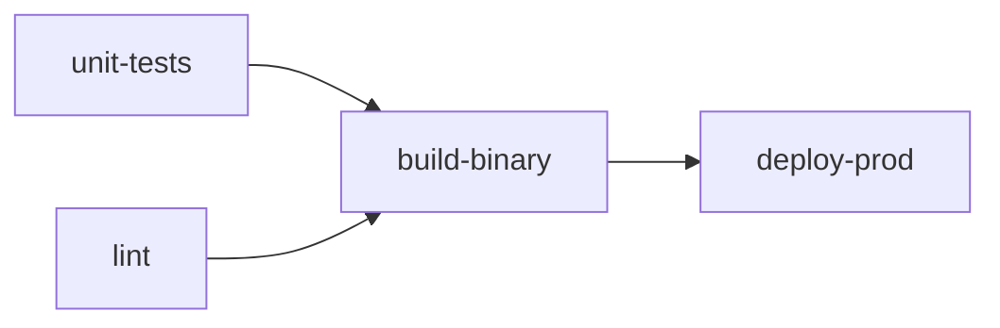

# Basic Example

Your first pisyn pipeline — test, build, deploy in under 50 lines.

## What This Shows

This is the "hello world" of pisyn. It demonstrates the core construct tree and the most common job configuration options, targeting all three platforms simultaneously.

### pisyn Features Used

- **Multi-platform synthesis** — blank imports register GitLab, GitHub, and Tekton synthesizers at once
- **Pipeline triggers** — `OnPush()` and `OnPR()` for branch-based and merge request pipelines
- **Pipeline-level env vars** — `SetEnv()` for variables shared across all jobs
- **Stages and jobs** — the `App → Pipeline → Stage → Job` construct tree
- **Job configuration** — `Image()`, `Script()`, `Needs()`, `Timeout()`
- **Artifacts and caching** — `SetArtifacts()` with expiry, `SetCache()` for dependency caching
- **Platform-neutral variables** — `pisyn.VarCommitBranch`, `pisyn.VarProjectPath`, `pisyn.VarCommitSHA`
- **Deployment environments** — `SetEnvironment()` with name and URL
- **Manual trigger** — `SetWhen(pisyn.Manual)` for gated deployments
- **Conditional execution** — `If()` to restrict jobs to specific branches

## Pipeline Graph



## Run It

```sh
go run .                    # synthesizes GitLab, GitHub, and Tekton output
```

Output lands in `pisyn.out/`:
- `pisyn.out/.gitlab-ci.yml`
- `pisyn.out/.github/workflows/ci-cd.yml`
- `pisyn.out/tekton/`
