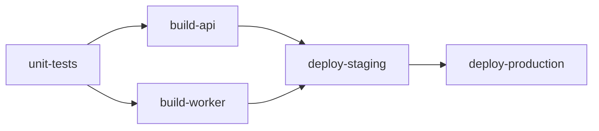

# Components Example

Build reusable pipeline components with typed parameters — the pisyn equivalent of GitLab CI components or GitHub reusable workflows, but with compile-time type safety.

## What This Shows

Instead of sharing CI templates as YAML files with string-based configuration, pisyn lets you define pipeline components as Go functions with typed config structs. Consumers get IDE autocomplete, compiler checks, and Go module versioning for free.

This example has three packages:

```
examples/components/
├── main.go              # pipeline that consumes the components
├── golang/golang.go     # Test() and Build() components
└── deploy/deploy.go     # Kubernetes() component
```

In a real project, `golang/` and `deploy/` would be a shared Go module:

```go
import "github.com/yourorg/ci-components/golang"
import "github.com/yourorg/ci-components/deploy"
```

### Components vs. Clone()

Both enable reuse, but they solve different problems:

| | `Clone()` | Components |
|---|---|---|
| **Interface** | Same builder API for every job | Custom typed config per job type |
| **Validation** | None — any field combination is valid | `panic()` on missing required fields |
| **Encapsulation** | Caller sees all job internals | Component hides implementation details |
| **Best for** | Stamping variations of the same job | Packaging opinionated, self-contained job types |

Use `Clone()` when you want "the same job but with different scripts." Use components when you want "a Go build job" as a concept with its own rules.

### What the Components Do

**`golang.Test()`** — creates a Go test job. When `CoverProfile` is set, it automatically configures junit and coverage artifact reports. Panics if `GoVersion` is empty.

**`golang.Build()`** — creates a Go build job with stripped binaries. Automatically adds an `AfterScript` that reports the binary size. Defaults `BuildPath` to `./cmd/<BinaryName>`. Panics if `GoVersion` or `BinaryName` is empty.

**`deploy.Kubernetes()`** — creates a kubectl deployment job with automatic rollout status check and an `AfterScript` that lists pods for debugging. Supports manual gating. Panics if `Environment`, `Namespace`, or `ManifestDir` is empty.

### pisyn Features Used

- **Separate packages** — components live in their own packages, imported by the pipeline
- **Typed configuration** — `golang.BuildConfig`, `golang.TestConfig`, `deploy.KubernetesConfig`
- **Input validation** — `panic()` on missing required fields catches errors at synthesis time, not pipeline runtime
- **Automatic behavior** — components add artifact reports, after_scripts, and defaults based on config
- **Chaining after component call** — `golang.Build(...).Needs("unit-tests")` — the returned `*Job` supports the full builder API
- **Multiple builds in parallel** — two `golang.Build` jobs in the same stage
- **Manual deployment gate** — `deploy.Kubernetes` with `Manual: true`
- **Conditional execution** — `If()` to restrict staging deploy to the main branch

## Pipeline Graph



## Run It

```sh
go run .                    # synthesizes GitLab CI
```

Output: `pisyn.out/.gitlab-ci.yml`
