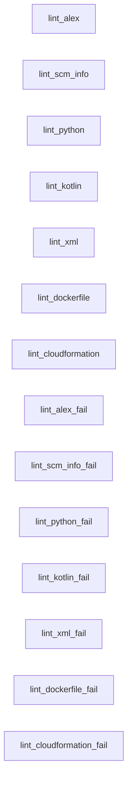

# Docs-as-Code Linting Pipeline

A real-world pipeline ported from production YAML — 14 linting jobs for multiple languages and file formats, demonstrating pisyn's ability to handle complex, enterprise-grade CI configurations.

## What This Shows

This is not a toy example. It's a pisyn representation of an actual GitLab CI pipeline that runs linters for Alex (inclusive language), scm-info validation, Python (ruff), Kotlin (detekt), XML, Dockerfiles (hadolint), and CloudFormation templates (cfn-lint). Each linter has a "pass" and "fail" variant for testing.

The original YAML was hundreds of lines of repetitive configuration. In pisyn, a single `baseLint` template captures the shared setup, and each linter is a `Clone()` with its specific overrides.

### pisyn Features Used

- **Job templates with Clone()** — `baseLint` defines shared services, retry, tags, interruptible, empty needs, and artifacts once; each linter clones and overrides
- **Clone-of-clone** — the `_fail` variants clone the already-cloned pass jobs, overriding just the test path and allow_failure
- **Service containers with variables** — `AddServiceWithVars()` for sidecar containers with Kubernetes resource requests
- **Image entrypoint override** — `ImageEntrypoint("")` for ruff and hadolint images that have non-shell entrypoints
- **Allow failure on specific exit codes** — `AllowFailureOnExitCodes(1)` for Python, `AllowFailureOnExitCodes(2)` for Kotlin, `AllowFailureOnExitCodes(2, 4, 6, 8, 10, 12, 14)` for CloudFormation
- **Retry with failure conditions** — `SetRetry()` with different `When` filters per job (some include `script_failure`, others don't)
- **Empty needs list** — `EmptyNeedsList()` so all linters start immediately without waiting for prior stages
- **Interruptible** — `SetInterruptible(true)` so newer pipelines cancel in-progress lint runs
- **Artifact reports** — junit, codequality, and annotation reports for GitLab integration
- **Pipeline-level variables** — `SetEnv()` for feature flags (`DAC_STAGE_INCLUDED`, `LA_JOB_INCLUDED`, etc.)
- **Before scripts** — `BeforeScript()` to `cd` into test directories before running linters
- **Multi-platform output** — targets both GitLab CI and GitHub Actions

## Pipeline Graph

All linters run in parallel with no dependencies between them:



## Run It

```sh
go run .                    # synthesizes GitLab CI and GitHub Actions
```

Output:
- `pisyn.out/.gitlab-ci.yml`
- `pisyn.out/.github/workflows/dac-lint-pipeline.yml`
