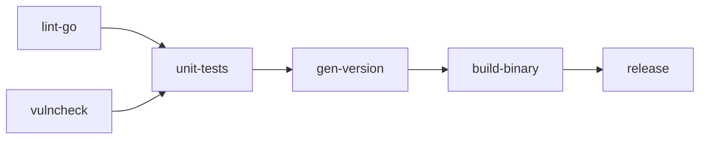

# Go Binary Pipeline

A production-ready, cross-platform pipeline for Go projects: lint, vulnerability check, test, build with version injection, and release.

## What This Shows

This is what a real Go project pipeline looks like in pisyn. It targets both GitLab CI and GitHub Actions from a single definition, using reusable templates to eliminate duplication across six jobs.

### pisyn Features Used

- **Reusable job templates** — `JobTemplate()` defines a base Go job once, `Clone()` stamps it into different stages with different scripts
- **Cross-platform output** — blank imports for both `gitlab` and `github` synthesizers
- **Protected branch triggers** — `OnPushProtected()` for pipelines on protected branches
- **Image entrypoint override** — `ImageEntrypoint("")` for the golangci-lint image
- **Interruptible jobs** — `SetInterruptible(true)` so newer pipelines can cancel in-progress jobs
- **Job outputs** — `Output()` and `OutputRef()` to pass the generated version string from `gen-version` to `build-binary` and `release`
- **Version injection via ldflags** — the build job injects `genVer.OutputRef("VERSION")` into the binary at compile time
- **GitHub Actions steps** — `AddStep()` for `actions/upload-artifact@v4` on the release job (silently ignored by GitLab)
- **Allow failure** — `AllowFailure()` on lint and vulncheck so they don't block the pipeline
- **Conditional release** — `If(pisyn.VarCommitBranch + ` == "main"`)` restricts the release job to the main branch

## Pipeline Graph



## Run It

```sh
go run .                    # synthesizes both GitLab and GitHub output
```

Output:
- `pisyn.out/.gitlab-ci.yml`
- `pisyn.out/.github/workflows/go-ci-cd.yml`
